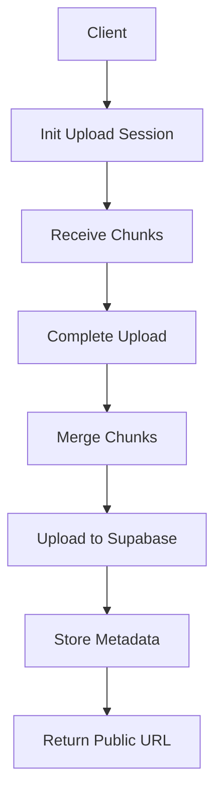

# Chunk Upload Backend

A robust backend service for handling large file uploads through chunked transfer, built with Node.js, Express, and Supabase.

[](https://nodejs.org/)
[](https://expressjs.com/)
[](LICENSE)

## Table of Contents

- [Overview](#overview)
- [Features](#features)
- [Architecture](#architecture)
- [API Endpoints](#api-endpoints)
- [Getting Started](#getting-started)
  - [Prerequisites](#prerequisites)
  - [Installation](#installation)
  - [Environment Variables](#environment-variables)
  - [Running the Application](#running-the-application)
- [Usage](#usage)
- [Project Structure](#project-structure)
- [Data Flow](#data-flow)
- [Scheduled Jobs](#scheduled-jobs)
- [Error Handling](#error-handling)
- [Contributing](#contributing)
- [License](#license)

## Overview

The Chunk Upload Backend is designed to handle large file uploads efficiently by breaking them into smaller chunks. This approach provides several benefits including improved reliability, better error recovery, and reduced memory consumption.

## Features

- ✅ Chunked file upload with resume capability
- ✅ Automatic chunk validation and integrity checking
- ✅ Temporary storage management with automatic cleanup
- ✅ Supabase integration for permanent storage
- ✅ Database metadata persistence
- ✅ CORS support
- ✅ Comprehensive error handling
- ✅ Health check endpoint
- ✅ Scheduled cleanup of stale uploads

## Architecture



## API Endpoints

### Initialize Upload Session
```http
POST /api/upload/init
Content-Type: application/json

{
  "fileName": "example.mp4",
  "fileSize": 1073741824,
  "mimeType": "video/mp4"
}
```

**Response:**
```json
{
  "sessionId": "uuid-string",
  "chunkSize": 1048576
}
```

### Upload Chunk
```http
POST /api/upload/:sessionId/chunk
Content-Type: multipart/form-data
X-Chunk-Index: 0

[Binary chunk data]
```

**Response:**
```json
{
  "received": true,
  "chunkIndex": 0
}
```

### Complete Upload
```http
POST /api/upload/:sessionId/complete
```

**Response:**
```json
{
  "success": true,
  "url": "https://your-supabase-url/storage/v1/object/public/your-bucket/example.mp4"
}
```

### Cancel Upload
```http
POST /api/upload/:sessionId/cancel
```

**Response:**
```json
{
  "canceled": true
}
```

### Health Check
```http
GET /health
```

**Response:**
```json
{
  "status": "OK",
  "message": "Chunk upload backend server v2 running at http://localhost:8080"
}
```

## Getting Started

### Prerequisites

- Node.js 18.x or higher
- npm or yarn package manager
- Supabase account with configured storage bucket
- Environment variables properly configured

### Installation

Clone the repository:
```bash
git clone https://github.com/your-username/chunk-upload-backend.git
cd chunk-upload-backend
```

Install dependencies:
```bash
npm install
# or
yarn install
```

### Environment Variables

Create a `.env` file in the root directory based on the `.env.sample`:

```env
PORT=8080
UPLOAD_TMP_DIR=./tmp
CHUNK_SIZE=1048576                    # 1 MiB
SUPABASE_URL=your_supabase_url
SUPABASE_SERVICE_ROLE_KEY=your_service_role_key
SUPABASE_BUCKET=your_bucket_name
```

### Running the Application

Development mode with hot reload:
```bash
npm run dev
# or
yarn dev
```

Production mode:
```bash
npm start
# or
yarn start
```

## Usage

1. Initialize an upload session to get a session ID and chunk size
2. Upload chunks sequentially using the session ID
3. Complete the upload to merge chunks and store in Supabase
4. Handle errors appropriately for retry mechanisms

## Project Structure

```
chunk-upload-backend/
├── src/
│   ├── controllers/
│   │   └── upload.controller.js    # Request handlers
│   ├── middlewares/
│   │   └── error.handler.js        # Global error handling
│   ├── routes/
│   │   └── upload.route.js         # API route definitions
│   ├── services/
│   │   ├── chunk.service.js        # Chunk management logic
│   │   └── supabase.service.js     # Supabase integration
│   └── app.js                      # Main application entry
├── cron/
│   ├── cleanup.js                  # Cron job scheduler
│   └── cleanupJob.js               # Standalone cleanup script
├── tmp/                            # Temporary file storage
├── .env.sample                     # Environment variables template
├── nodemon.json                    # Nodemon configuration
└── package.json                    # Project dependencies
```

## Data Flow

1. Client initiates upload session with file metadata
2. Server creates session and returns ID + chunk size
3. Client uploads chunks with sequential indices
4. Server validates and stores each chunk temporarily
5. Client signals upload completion
6. Server merges all chunks into complete file
7. File is uploaded to Supabase storage
8. Metadata is stored in Supabase database
9. Temporary files are cleaned up
10. Public URL is returned to client

## Scheduled Jobs

A daily cleanup job removes stale upload sessions older than 24 hours:

```bash
# Run manually
npm run cleanup
```

The cleanup job runs automatically every night at 02:00 when started with the full application.

## Error Handling

The application implements comprehensive error handling:

- Input validation for all endpoints
- Graceful handling of missing chunks
- Proper HTTP status codes
- Detailed error messages
- Global error middleware

Common error responses:
- `400 Bad Request` - Missing or invalid parameters
- `404 Not Found` - Session not found
- `500 Internal Server Error` - Unexpected server errors

## Contributing

1. Fork the repository
2. Create a feature branch (`git checkout -b feature/amazing-feature`)
3. Commit your changes (`git commit -m 'Add amazing feature'`)
4. Push to the branch (`git push origin feature/amazing-feature`)
5. Open a Pull Request

## License

This project is licensed under the MIT License - see the [LICENSE](LICENSE) file for details.

---

Built with ❤️ using Node.js, Express, and Supabase